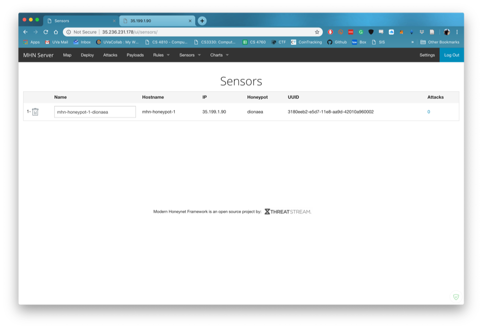

Milestone 1:

The above command allows for incoming traffic on ports 3000 and 10000 to
be sent through.
On google cloud I created a project to be used for this activity.

Upon running the next command I get an error saying the zone is
overloaded and cannot process the request.

The startup worked correctly in a new
zone.
Milestone 2:

Using an install command from Piazza I was able to install and activate
man
After adding tcp:80 ingress activity I was able to see the login page on
the specified ip.

Milestone 3:

Using the codepath commands I was able to create a
second
firewall and VM for the honeypot. After that I used ssh to gain access
to the honeypot.

Miles

Using the command generated in the admin deploy console I was able to
create a honeypot on the second VM.

Milestone 5:

Using the Nmap command I was able to search for open ports on the
honeypot VM

After running this command I loaded the attacks page in the admin VM and
I was able to see the activity where I requested information from the
honeypot VM. Using this system I would be able to see anytime the
honeypot VM was accessed by any outside source.

